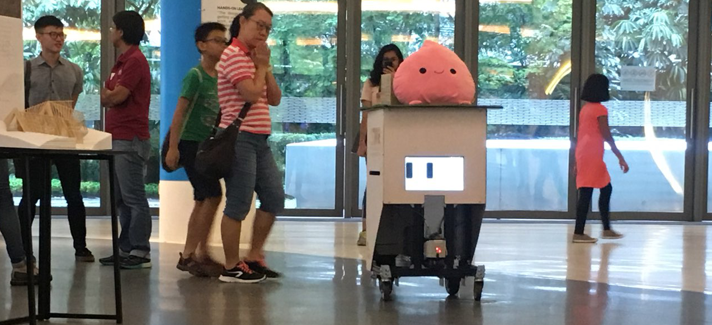

# MOMObot


[](https://youtu.be/F5m3qasmmTs)


**MOMObot** (MOdular MObile Robot) is a **ROS enabled autonomous ground vehicle for service** by the **SUTD Organisation of Autonomous Robotics**!

Based off of the [Linorobot](https://linorobot.org) framework!


**Features:**

- Autonomous navigation
- Local obstacle avoidance
- Expressive emotion module
- Location based voice-lines


## Pre-Requisites

- Same pre-requisites as the [Linorobot](https://linorobot.org)
- We prefer to use [catkin tools](<https://catkin-tools.readthedocs.io/en/latest/installing.html>) as well!


## Setup

This repo contains an entire momobot workspace!

You can put the workspace anywhere else you want, but just make sure you actually build it after the fact.

```shell
# Clone the repo and go into the repo folder
git clone https://github.com/methylDragon/momobot.git
cd momobot

# Start all submodules (we have quite a few!)
git submodule update --init --recursive

# Then build the workspace. If you want the workspace anywhere else, do copy it there
# Then run the build command at the workspace
# Don't forget to source it!
cd momobot_ws
catkin build # Or catkin_make , if you don't have catkin tools installed
source devel/setup.bash # Source the workspace
```


## Media


[We got featured on the news!](<https://www.straitstimes.com/singapore/sutd-to-develop-new-design-and-ai-degree>)

​    

---

