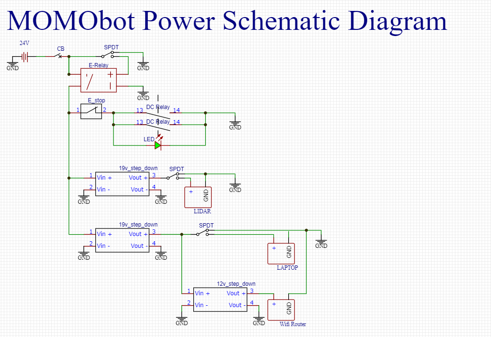
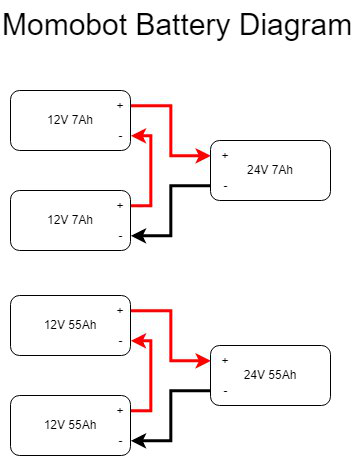
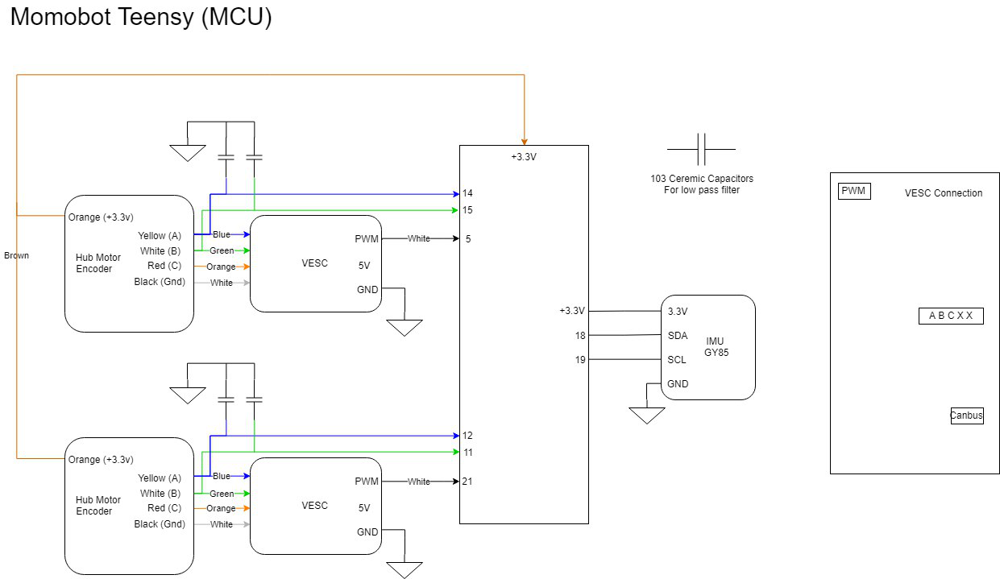

Electronics
===========

It powers the controlling system, including the lidar, VESC, Teensy, laptop , router as well as two solid state relays
Two solid state relays were used.

2.1 Electronic BOM
------------------

Power Source
^^^^^^^^^^^^

- 2x 12V 55Ah Pb acid batteries (Connected in Series)
- 2x 12v 7Ah Pb acid batteries (Connected in Series)
- Terminal Blocks for Power Distribution
- 3x el cheapo (Taobao) variable voltage Buck (literally worth the buck) Converter (replace pls) (current settings 2x 19V, 1x 12V)

Sensors
^^^^^^^

.. |ss| raw:: html

   <strike>

.. |se| raw:: html

   </strike>

- 1x LMS111 LiDAR
        - 20m range, 270 degree FOV
        - For obstacle detection, and mapping, for navigation
- Motor Encoders (Came With Motors)
    - Measure how far motors have turned, important for odometry
- GY-85 IMU
    - Important for Odometry, provides another source
- |ss| Marvelmind Indoor GPS |se| (Currently not in use, for a 3rd possible
  global pose data source)

Actuators, Display and Outputs
^^^^^^^^^^^^^^^^^^^^^^^^^^^^^^

- 1x Waveshare 13.3" HDMI LCD (H) with case
        - https://www.waveshare.com/13.3inch-hdmi-lcd-h-with-case.htm
- 2x Flipsky 50A Continuous VESC v4.12 (Using JST-PH)
        - Normal ESC did not work for our specced motor
- 350W 24V Brushless DC Scooter Hub Motor
        - https://www.aliexpress.com/item/24V-36V-48V-8Inch-Electric-Wheel-Hub-Motor-350W-Brushless-Non-Gear-Hub-Motor-For-Electric/32837818637.html
- Teensy 3.2 (Original from PJRC)
- Cheap speakers

Safety and Power Control
^^^^^^^^^^^^^^^^^^^^^^^^

-    1x Schnieder DC Circuit Breaker 125V 20A (2-way)
-    1x Schnieder DC Circuit Breaker 125V 16A (1-way)
-    2x CDG1-1DD/40A Solid State Relay
-    1x CDG1-1DD/25A Solid State Relay
-    Heat sinks
-    1x A22E-M E-stop
        - Application: Switch (Option, Others)
        - Conforming series: φ22/ 25 switch, indicator light
        - Type: Operating unit (non-illuminated type)
        - Details of shape: Medium type (φ40)
        - Colour: Red
        - Protection function: IP65 oil resistant type
        - Push button operation: Push to lock/turn to reset
        - Light Source Type: Non-Illumination
        - Voltage Uses Light Source(V): Non-Illumination
-    3x KR2-11 Rocker Switches (Red and Green)
        - Type: On/Off, DPST
        - Rating: 10A/250VAC
        - Mechanical life: 50,000 cycles
        - Insulation: 500MΩ
-    1x XK-A6/-Y Enclosure Electronics Box (E-box)
        - Enclosure types: Enclosure with 6 Ø22.5mm holes
        - Shell material:Plastic
        - IP grades:IP65
-    1x AD16-22D/S Green LED Pilot Light Panel Indicator
        - Voltage: 24V
        - Rated Current: 20mA
        - Material: Plastic, Electric Components
        - Thread Diameter: 22mm / 0.87"
-    1x Terminal Block (within the E-box)

Connectors
^^^^^^^^^^

-    8x XT90 Connectors (Male and Female)
-    2x 6mm Barrel Jacks
-    Laptop power adapter

2.2 Start-Up, Shut-Down Procedure
---------------------------------

Start-Up (FULL)
^^^^^^^^^^^^^^^

1. Check the battery leads and ensure that the batteries are connected in series
2. Electronics breakers to be Switched to "ON"
3. Set the Green electronics switch to "ON"
4. Motor Breakers to be switched to "ON"
5. Set the E-stop to "OFF"

Shut-down (FULL)
^^^^^^^^^^^^^^^^

1. Set the E-stop to "ON"
2. Switch the Motor breakers to "OFF"
3. Set the electronics switch to "OFF"
4. Set the electronics breaker to "OFF"
5. Disconnect battery leads

Start-Up (truncated)
^^^^^^^^^^^^^^^^^^^^

This assumes the batteries have been connected beforehand
1. Electronics switch to be set to "ON"
2. E-stop set to "OFF"

Shut-down (truncated)
^^^^^^^^^^^^^^^^^^^^^

1. E-stop set to "ON"
2. Electronics switch to be set to "OFF"
3. Disconnect the battery leads

2.3 Gotchas, Hacky Stuff and Things to Take Note Of
---------------------------------------------------

- 2x16AWG wires used to take high current out of battery, as we did not have thick enough wires at the time. The wire usage was not consistent, as some were salvaged PVC wires from the previous bot. Suggested to use all silicone coated wires with low gauge for higher termperature endurance and lower resistance.

- Encoder and PWM input wires from Teensy to the VESC was connected using jumper cables rather than specific JST-PH connectors. Encoder wires were spliced to 2, one to VESC, one to teensy, causing a mess of wires and potential intermittent connections.

- All bulk converter displayers are broken - they show a wrong voltage.

- VESC can be better positioned to be easier USB tunned, and the layout should be revised for easier switch fliping.

- No voltage monitoring circuit included in either of the two electrical system, making monitoring and preparing for recharge difficult. 19v for fully charged, 18.1v for need to charge. Circuit needed to be implemented to prevent either of the batteries from over-discharging.

- The lack of a charging circuit made the life of the maintenance team difficult. Much more troubles of disconnecting the batteries for recharging and connecting back for operation

2.4 Circuit Diagrams
--------------------

* The robot consists of two power systems
* 24V with smaller battery capacity and 24V with bigger battery capacity
* Both 2 cells in series to boost the voltage for the motors, as well as the lidar

Power
^^^^^

.. image:: ../assets/MOMObot_Power_Diagram.png
  :alt: teensy_connections

Electronics Schematic
^^^^^^^^^^^^^^^^^^^^^^

2.5 Motor Tuning
----------------

VESC tuning
^^^^^^^^^^^

Follow link for VESC tuning documentation
- :ref:`vesc_doc_main`

FOC signal
^^^^^^^^^^

VESC also has internal PID control which is not modified in the original
MOMObot because the PPM signals sent to the motors have been PID-ed in the
ROS stack.

- When tuning the PPM signal centre, max and min, ensure that the ROS stack is
  running.
- The neutral signal will be the "centre", max forward throttle will be "max"
  PPM and max reverse throttle "min" PPM.
- The deadband of 10% is selected to allow MOMO to gain enough throttle to
  overcome initial traction.
- A PPM deadband of < 2% is not recommended as it means any small fluctuation
  in PPM will command motor response.

..

  3 days work tuning the settings

Read lots of guides for Duty settings - values that work
After tuning the VESC's PPM and Duty Cycle settings, remember to write the settings else they will not be saved.

Momo charges alot
^^^^^^^^^^^^^^^^^

Possible due to the I component of PID increasing when attempting to Pivot, then when transitioning to a forward movement, the built up I causes a surge in motor response.

Room for improvement
^^^^^^^^^^^^^^^^^^^^

- FOC profile can be improved (FOC settings , will have lots of variables to tune to fit the curve better)
- Positive, negative ramping time

2.6 PID Tuning from the MOMObot side
------------------------------------

**Edit the config file**

1. ``roscd momobot/teensy/firmware/lib/config/``

2. ``nano momo_base_config.h``

3. Change these parameters:

  - Differential drive

  - USE_ESC

  - Kp, Ki, Kd

  - Encoder pins, can be changed in hardware or code

Use the Linorobot `PID tuning guide <https://github.com/linorobot/linorobot/wiki/2.-Base-Controller>`_!
